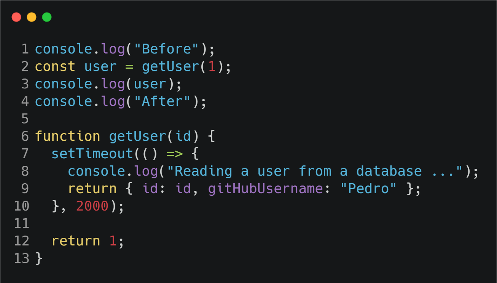
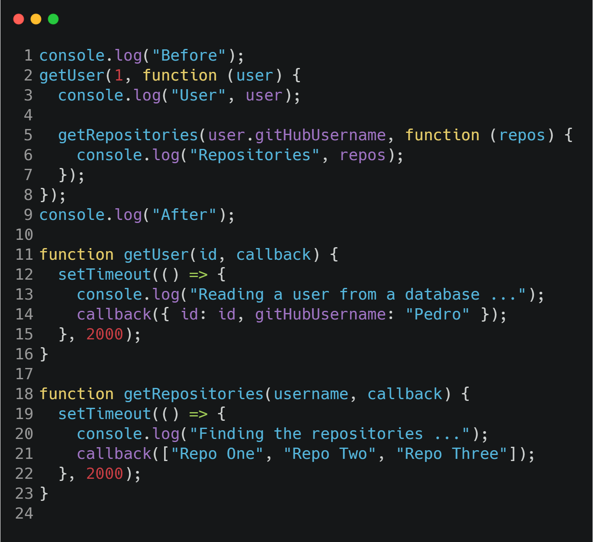
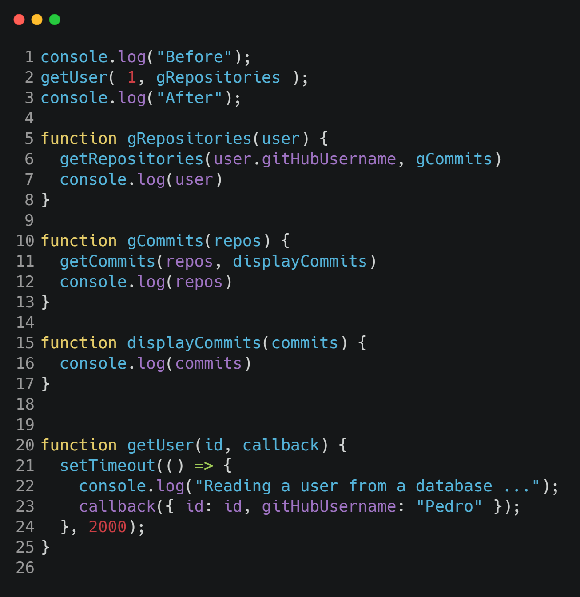
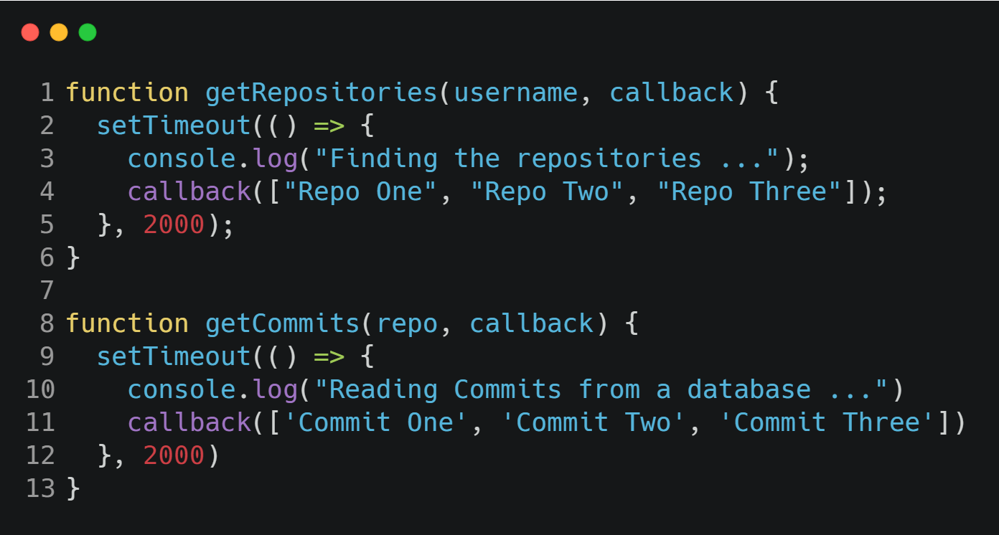
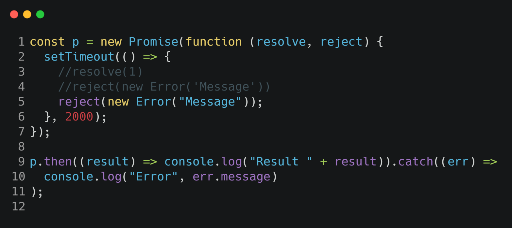

# Async Javascript

---

### It's really important to we understand how does it works, because async code is a quite often in complex code.

#### In this example above we can see a short piece of that.



#### I line 2 we are callin the function getUser and passin one as a parameter, if we see the line 7 we have setTimeout in the block, and what its going to happen is that the return from line 12 is going to appear and then the stament inside the setTimeout is going to run again, but, the return is not going anymore to appear.

#### Callback, Promises and Async Await are one of the options to get the result from a asynchronous operation.

---

## Callbacks

#### To receive the result from an async function we need to use callbacks, in the example above you will see it more clear



#### If we pay attention to line 11 and 18 we will se that we have callback as a parameter, and these params are passed in lines 2 and line 5. I the _getUser()_ we are passing a void function that will be our callback, it recieves the user as a parameter, in the console.log() from line 3 we will se the entire object from line 14.

#### At line 5 we noiteced that we can acess the object properties and nother void _function()_ and receives as parameter the repositories array, and then this function will run the _console.log()_ and show in the console the repo array

---

## Nasted Functions

#### Take a look at this example, in the previous examples our code was looking as a christmas tree. In this new version we have reduces a lot the code.





#### Looking at this code its a way better than the previous examples, if we see there is a nasted calling, in line 2 we have instaciated the function and then called that one, we pass gCommit as a callback that will be execured in getRepositories().

---

## Promises

#### When we are calling a promisse, it will allways return something for you in out code its rejecting so it faild and then it throw a error message



#### If the promisse was sucessfull it will return one, if it's now i returns the Error message that is Message.

---

## Promises (Consuming)

#### When we are going to consume some promisses it's importnat to use the catch and then for that. Take a o look at this example.

```javascript
getUser(1)
  .then((user) => getRepositories(user.gitHubUsername))
  .then((repos) => getCommits(repos[0]))
  .then((commits) => console.log("Commits " + commits))
  .catch((err) => console.log("Error" + err.message));
```

#### With that we dont need anymore that messy structure in our code, if the previous promisse were sucessefull we simply accept that and run the next Promisse.

```javascript
function getUser(id) {
  return new Promise((resolve, reject) => {
    setTimeout(() => {
      console.log("Reading a user from a database ...");
      resolve({ id: id, gitHubUsername: "Pedro" });
    }, 2000);
  });
}

function getRepositories(username) {
  return new Promise((resolve, reject) => {
    setTimeout(() => {
      console.log("Finding the repositories ...");
      resolve(["Repo One", "Repo Two", "Repo Three"]);
    }, 2000);
  });
}

function getCommits(repo) {
  return new Promise((resolve, reject) => {
    setTimeout(() => {
      console.log("Reading Commits from a database ...");
      resolve(["Commit One", "Commit Two", "Commit Three"]);
    }, 2000);
  });
}
```

#### In that exaple we see that the functions dont have any callback to return the values, with promises we can remove that because the async function will return a resolve or reject with the value that we want.

---

## Promise a little bit more

```javascript
const p = Promise.resolve({ id: 1, name: "Pedro"})
p.then(result => console.log(result))
```

#### In this first line, if the calling is successful we pass resolve, and the object that we want to show, in fact it's going to be successful because it already pass the the resolve. At the second line we are passing then, it's going to return in the *console.log()* the result of that promisse.

```javascript
const p = Promise.reject(new Error("Error Message"))
p.catch(err => console.log(err))
```

#### At this point we are passing that our promisse is already rejected, that's the idea, in the second line we catch the error and handle that to show in the *console.log()*. And the reason that we are passing *new Error("Message Stuff")* is related to the Object Error, if we only pass an single string we are only going to see that string not the Object Error.