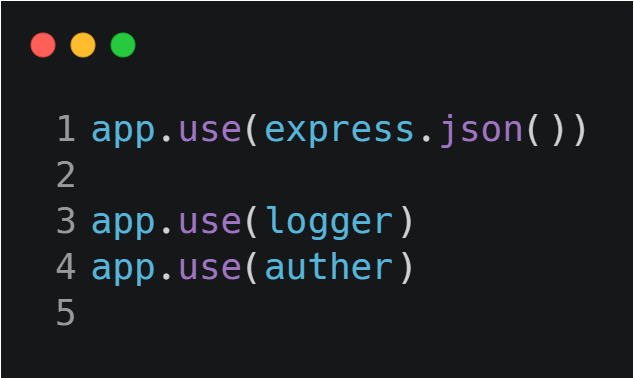
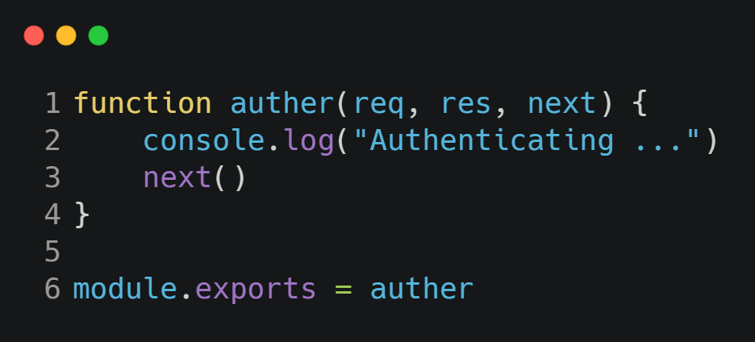
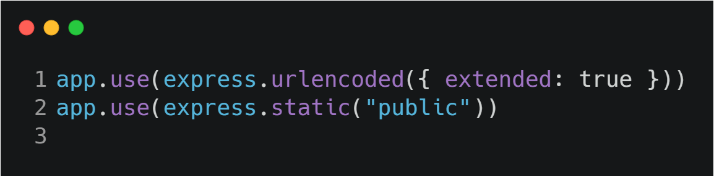
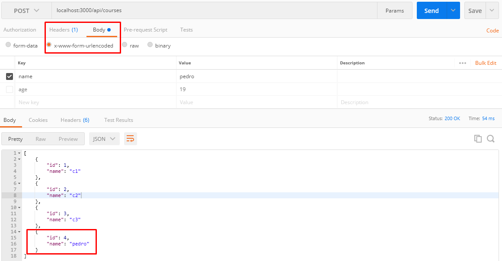

# Using Middleware
-----
### *Introduction*

#### Now we are going to talk a little bit about middleware, one of the core features of *express.js*, at this first moment we can consider that Middleware is a function that recieves *req, res and next* as parameters.

* Execute everything
* Change Objects and Response and Request
* Close the req res cycle
* Call Another Function

### *Example*
#### Remember to import the function. *const logger = require("./logger"), const auther = require("./auth")*

#### Example of middleware function, remember allways to import and export, all the functions receives *req, res and next* as parameters

-----

## Built-in Middleware

#### Sometimes we are going to see some built-in middlewares like these bellow.

#### In line one we can pass the values throw urlendode form in postman, check it out.

#### In line 2 if you try to acess the *file.txt* you will see that the file will be there for you.