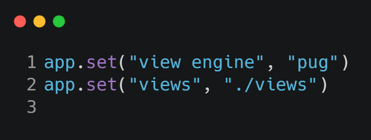

# Configurations

-----

#### Now we are going to config some statemets for our app, first lets create the folde config and then the files *default.json, development.json, production.json and custom-environment-variables.json.*

#### These files are going to specify the name of the aplication and the mail server, there is a plust we can store the mail password in varible enviroment.

#### Before we start, it's important to install this depedancy, this is how we manage our configs.

```
npm i config
```

### Run this command in your terminal (Windows)

```
SET app_password=123
```

### *production.json, development.json*


### *custom-environment-variables.json*


-----

## Debuging

#### In this part we are going to use debugion package, that's a new way to debug our application. Sometimes we use *console.log()*, but, debug is more elegant and shorter.

```
npm i debug
```

#### In the front of the require('debug')(*NAME*), after you configure and import you can simply acess like this.

```
  appDebuger("Morgan Enable")
```

-----

## Template Engine

#### Some people like to use template engine can choose that, up to you, in this situation we are using PUG.

```
npm i pug
```

#### We need to set the engine template in our express server.



#### In the first line we have set the engine and which template we are going to use, at the second line the first parameter is the folder name and the second the path