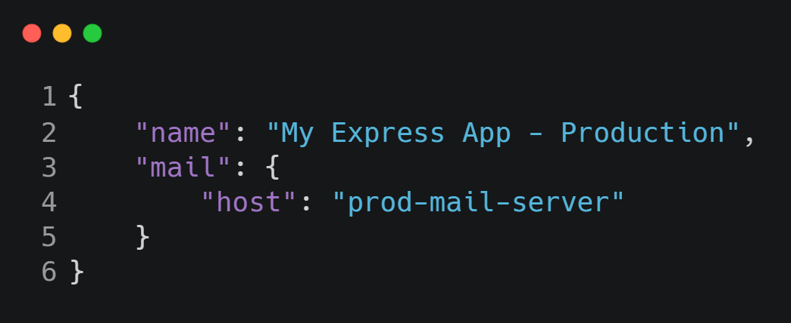
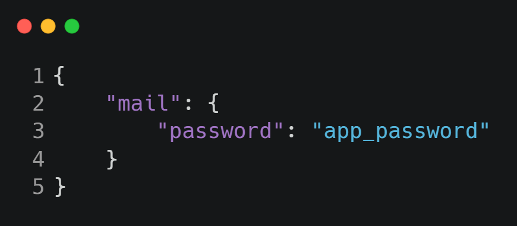

# Configurations

-----

#### Now we are going to config some statemets for our app, first lets create the folde config and then the files *default.json, development.json, production.json and custom-environment-variables.json.*

#### These files are going to specify the name of the aplication and the mail server, there is a plust we can store the mail password in varible enviroment.

### Run this command in your terminal (Windows)

```
SET app_password=123
```

### *production.json, development.json*




### *custom-environment-variables.json*



