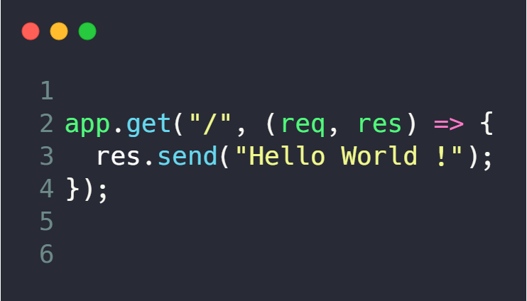
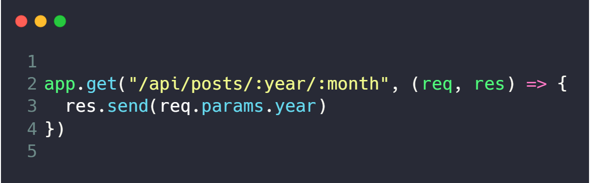
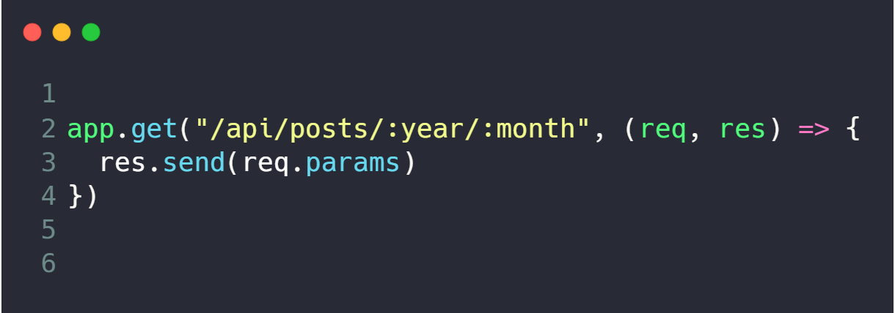
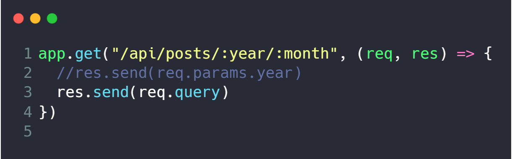

# Express HTTP - Using CRUD
-----

### *Basic ideas*

* #### **GET** - *It is used when data fetching is required from the server for representation on the client-side.  *
* #### **POST** -* It is used when the request is sent through forms secretly. The server accepts data in the request as a new entity identified by URI.*
* #### **PUT** - *It is used to store and update data. If an object exists already, it updates or modifies it. If the object does not exist, it creates new one.*
* #### **DELETE** - *It is used to delete data from the server.*

-----

## **Simple GET Request**

#### app.get(), receives two params first the **PATH** and the second it's a **Callback Function**.
-----
## **Simple POST Request**

-----

## **Route Parameters**

#### We can simply acess parameters from the url following this logic above, you can pass whatever you want, doesn't matter at all the name of the varible itself.

#### It doesn't matter at all how many params did you passa throw the URL, if you would like to acess **all** the params you can simples acess with **res.params**

#### If you want to acess Querystring values **res.query**
-----
