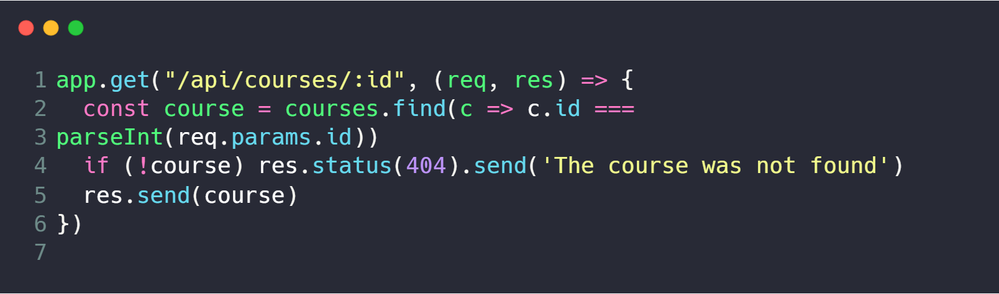
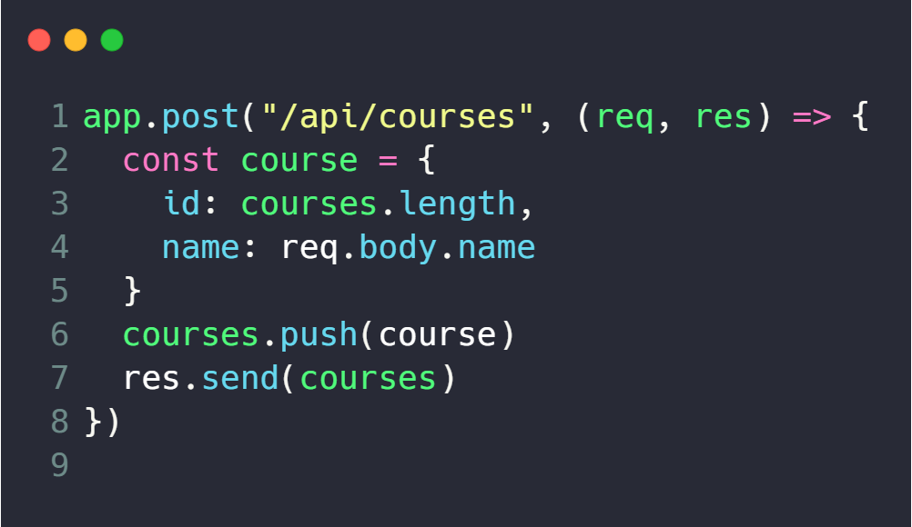
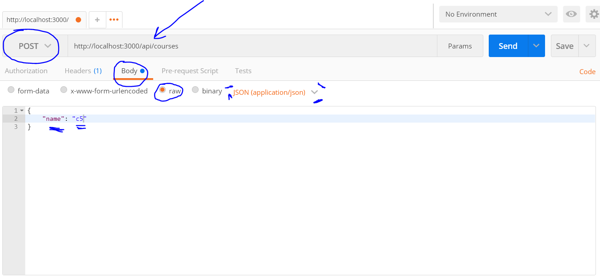
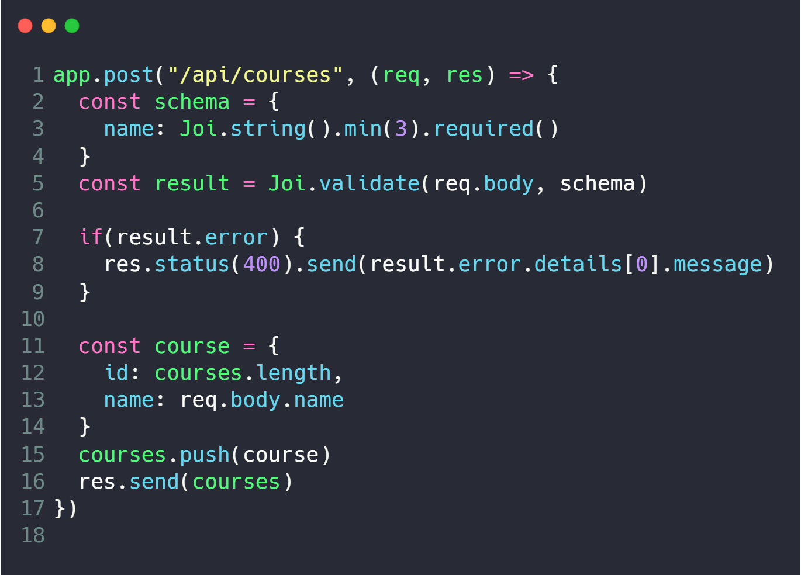

# Express HTTP - Using CRUD
-----

### *Basic ideas*

* #### **GET** - *It is used when data fetching is required from the server for representation on the client-side.  *
* #### **POST** -* It is used when the request is sent through forms secretly. The server accepts data in the request as a new entity identified by URI.*
* #### **PUT** - *It is used to store and update data. If an object exists already, it updates or modifies it. If the object does not exist, it creates new one.*
* #### **DELETE** - *It is used to delete data from the server.*

-----

## **Simple GET Request**

#### app.get(), receives two params first the **PATH** and the second it's a **Callback Function**.

#### The first param wait for an URL inside, that url it could recieve a paramter ID and then in line 2 **cont course** will recieve the result of the find method inside the array **courses**. If the course doesn't exist it will return **res.status(404)** It will represent the status code of NOT FOUND, if you would to send a custom message simply add **.send('text here')**. Finally, if there's any problems we use **res.send(course)**
-----
## **Simple POST Request**

#### Post reques is when we would like to inset something inside the API, sooner we can get that if we use these logic.

#### You can noitce that, in line 2 to 5 we are creating an course object that will create an ID by course array length and then the key NAME extract from que **request body** the value name.

#### If you would like to send the data, we need to have post man, just be carefull. Follow these images below

#### Remeber that we are using a middleware that is **app.use(express.json())** that middleware allow us to acess the body data from the request.
-----

## **Route Parameters**

#### We can simply acess parameters from the url following this logic above, you can pass whatever you want, doesn't matter at all the name of the varible itself.

#### It doesn't matter at all how many params did you passa throw the URL, if you would like to acess **all** the params you can simples acess with **res.params**

#### If you want to acess Querystring values **res.query**
-----

## **Input Validation**

#### Allways that we are receiving data from the user, it's really important that we check and validate those informations.

#### And for that reason i'm using Joi, it's a package that help us to validate that process, for example. In our case we want to validate the name body req, it must have at minimum 3 chart to add the information.

#### In line 2 to 4, we define our schama that basicly we pass how the information must be made. Then in line 5 we get the result, and if the result.erro is true it's going to throw the error status and send the error. It's only going to happend if the information doesn't follow the structure