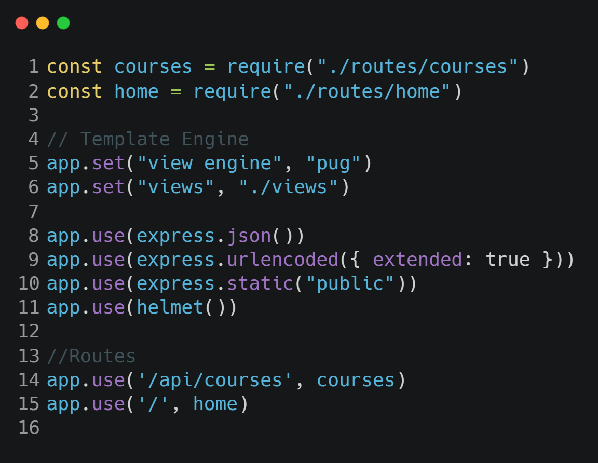
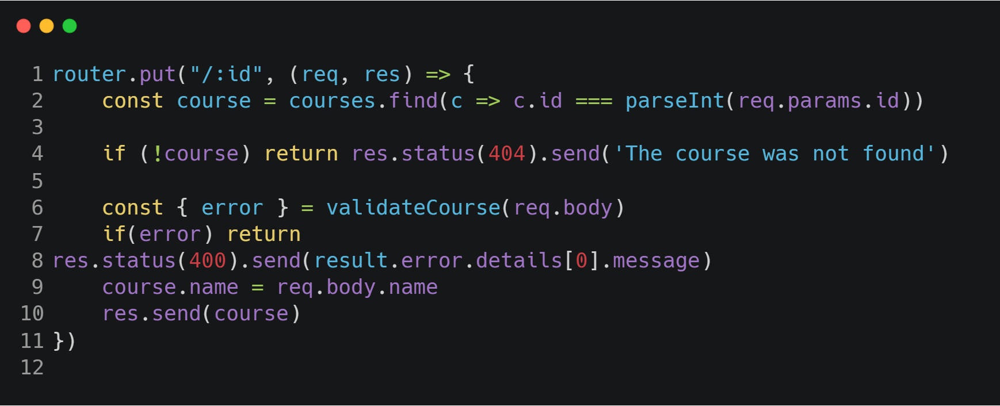

# How to structure
-----

### Reason

#### In the past examples our index.js was really big, in reasons of the routes to fix that we had created a new folder named routes and improted them.

#### In line 1 and 2, we had imported the routes, then in line 14 we pass to the the "middleware" the name of the path just to make it shorter in the route file.

#### As you can see in the line one we have omitted the entire path the reason of that is because in the index.js file in lune 14 we have already passed the path that the routes are going to listen, we dont need to write all the time in the route file /api/courses/, if we pass that parameter it's going yo help us a lot.